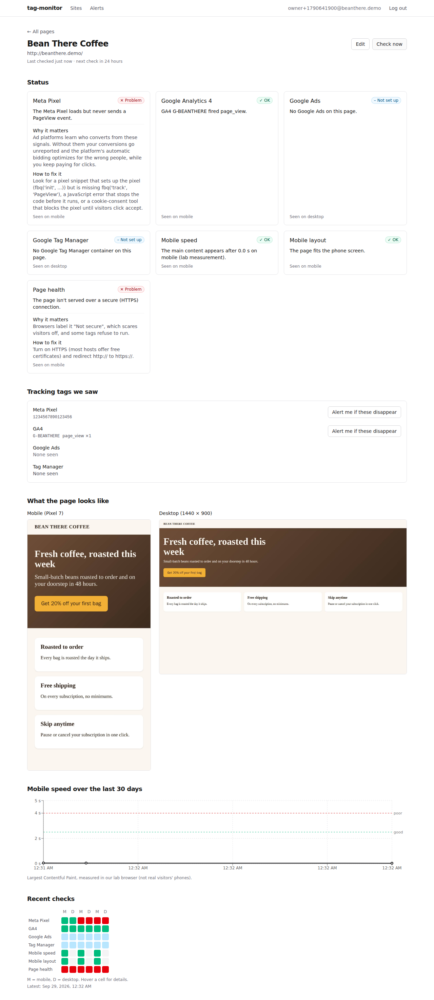
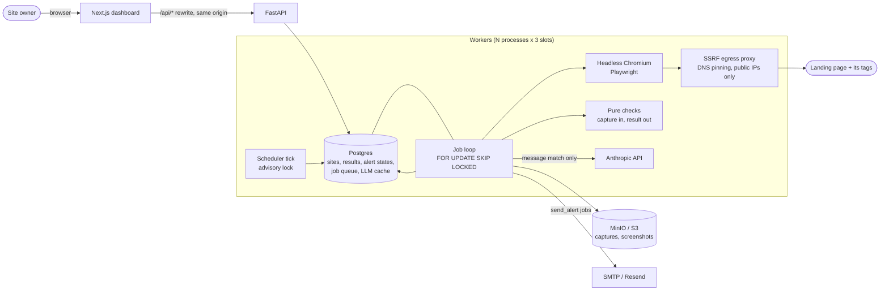

# tag-monitor

**Know the moment your Meta Pixel or Google tags stop firing on your ad landing pages.**

Small businesses spend real money sending ad clicks to landing pages whose tracking silently broke: a theme update drops the pixel, a cookie banner blocks it, someone deletes the Tag Manager container. The ads keep spending, reporting goes blank, and the platforms' bidding optimizes for the wrong people. tag-monitor loads each landing page in a real headless browser on a schedule, watches the network requests the tags actually send, and emails once, in plain English, when something that used to work breaks, then again when it's fixed.

<!-- Demo GIF: record one with `scripts/demo_walkthrough.py --video` (see "Try the demo"). -->
> _Demo GIF placeholder._ Screenshots of the full flow (sign up, add a page, break the pixel, get the alert, fix it, get the recovery email) are in [docs/milestones/M7.md](docs/milestones/M7.md).



## What it checks

| Check | How | Fails when |
|---|---|---|
| **Meta Pixel** | `fbevents.js` loads, and `facebook.com/tr` hits carry `ev=PageView` (GET or POST) | installed but not firing, script blocked, wrong pixel ID, missing (if you said it should be there); PageView sent twice is a warning |
| **GA4 / Google Ads / Tag Manager** | `/g/collect` hits (including batched POST bodies), the Ads conversion endpoints, `gtm.js?id=GTM-...` | the same vocabulary as Meta, per tag |
| **Mobile speed** | Largest Contentful Paint on an emulated Pixel 7 (a lab measurement) | over 4 s (over 2.5 s warns) |
| **Mobile layout** | viewport meta tag, horizontal overflow at the device's width | missing viewport; overflow warns |
| **Page health** | the main document's status, redirects, final domain, HTTPS, JavaScript errors | an error page, plain HTTP; unusual redirects and JS errors warn |
| **Message match** (optional) | Claude compares your ad copy with the text a phone shows before scrolling | the page doesn't deliver what the ad promised |

Every outcome has a plain-English "what we saw / why it matters / how to fix it", used by both the dashboard and the emails: [docs/check-explanations.md](docs/check-explanations.md).

## How it works



**Capture once, analyze many.** A worker loads the page on mobile and desktop and records everything into a `PageCapture`: every network request (including POST bodies), the redirect chain, console errors, performance timings, and DOM facts. It stores the capture as JSON next to a screenshot. The checks are pure functions of that capture, so they're unit-tested against saved captures and can be re-run on old ones when a detection pattern changes ([ADR-005](docs/decisions.md#adr-005-capture-once-analyze-many-m2)).

**Network observation, not HTML search.** A pixel snippet in the HTML proves nothing; a `PageView` request leaving the browser does. The checks recognize the tags' real endpoints, which catches the failures that matter: installed but never fires, blocked, the wrong ID, firing twice ([ADR-008](docs/decisions.md#adr-008-detect-tags-by-observing-network-requests-not-by-searching-the-html-m3)).

**One clear alert, not fifty.** Each (site, check) pair has a small state machine (healthy, suspect, alerting). A first failure only makes the check "suspect" and schedules a confirmation re-check 10 minutes later; only a second failure alerts. A page that's down produces one "your page is down" alert, not one per tag. Alert rows are written in the same transaction as the results that caused them (a transactional outbox), and a dedupe key means a retry never sends twice ([ADR-012](docs/decisions.md#adr-012-confirm-a-failure-with-a-re-check-before-alerting-m5), [ADR-013](docs/decisions.md#adr-013-transactional-outbox-for-alerts-m5)).

**A Postgres job queue.**
- Workers claim jobs with a single `UPDATE ... WHERE id IN (SELECT ... FOR UPDATE SKIP LOCKED)`.
- Leases have heartbeats, a reaper rescues jobs from dead workers, and retries use exponential backoff with jitter.
- An advisory lock lets one scheduler tick run at a time.
- A per-domain advisory lock loads at most one page per website at a time, across all workers ([ADR-010](docs/decisions.md#adr-010-the-job-queue-lives-in-postgres-m4), [ADR-011](docs/decisions.md#adr-011-advisory-locks-for-the-scheduler-the-reaper-and-per-domain-politeness-m4)).

**Loading a URL a user typed, safely.** Every request the browser makes (navigation, redirect hop, subresource) goes through a per-capture egress proxy. The proxy resolves DNS itself, refuses private, loopback, link-local and metadata addresses (including IPv4-mapped IPv6, 6to4, Teredo and NAT64 forms), and pins the connection to the address it checked ([ADR-004](docs/decisions.md#adr-004-enforce-the-ssrf-guard-in-a-per-capture-egress-proxy-not-only-in-contextroute-m2)).

## Queue scaling benchmark

`make bench` runs 500 real site checks against local fixture pages with 1, 2, 4 and 8 worker processes and verifies that no job ran twice. Results, with the machine they ran on: [docs/performance.md](docs/performance.md).

## Research findings

The research scan loads a hand-compiled list of public small-business websites once each, on a phone profile, respecting robots.txt, and publishes aggregate numbers only. It uses the same capture and checks as monitoring ([ADR-016](docs/decisions.md#adr-016-the-research-scan-reuses-the-monitoring-pipeline-and-publishes-aggregates-only-m8)).

**Not run yet.** The target list is compiled by hand, and the tooling is ready: `make scan NAME=...` then `make findings NAME=...` writes `docs/findings.md` (methodology, limitations, 95% Wilson intervals) and the landing page's numbers. Highlights will go here once a real scan has run.

## Message match evals

How often does the model's 1-5 message-match score agree with a person's? The tooling ([evals/message_match/README.md](evals/message_match/README.md)) covers:

- **Collection** freezes each page's text, so the dataset stays reproducible.
- **Labeling** is a blind, resumable terminal session.
- **The split** is by page, so no page's text is in both dev and test.
- **Scoring** runs a prompt version through the same code path as production. The report gives exact and within-1 agreement, quadratic-weighted kappa (cross-checked against scikit-learn), MAE, bias, a confusion matrix, and cost.
- **The rule:** prompts are tuned on dev, and test is scored once.

**Not run yet.** The labels have to come from a person. Results will go here from `evals/message_match/results/report.md`.

## Design decisions

All in [docs/decisions.md](docs/decisions.md), each with context, the decision, the alternatives considered and the consequences. The ones worth reading first:

- **A Postgres queue instead of Redis/Celery.** The jobs, the results they produce and the alerts those trigger commit in one transaction. There's one fewer system to run, and `SKIP LOCKED` is fast enough at this scale (see the benchmark). [ADR-010](docs/decisions.md#adr-010-the-job-queue-lives-in-postgres-m4)
- **Capture once, analyze many.** [ADR-005](docs/decisions.md#adr-005-capture-once-analyze-many-m2)
- **Network observation vs HTML search.** [ADR-008](docs/decisions.md#adr-008-detect-tags-by-observing-network-requests-not-by-searching-the-html-m3)
- **A confirmation re-check before alerting,** and **a transactional outbox** for the emails. [ADR-012](docs/decisions.md#adr-012-confirm-a-failure-with-a-re-check-before-alerting-m5), [ADR-013](docs/decisions.md#adr-013-transactional-outbox-for-alerts-m5)
- **Advisory locks** for the scheduler and for per-domain politeness. [ADR-011](docs/decisions.md#adr-011-advisory-locks-for-the-scheduler-the-reaper-and-per-domain-politeness-m4)
- **The SSRF egress proxy.** [ADR-004](docs/decisions.md#adr-004-enforce-the-ssrf-guard-in-a-per-capture-egress-proxy-not-only-in-contextroute-m2)
- **A same-origin proxy** so the session cookie stays first-party. [ADR-003](docs/decisions.md#adr-003-same-origin-proxy-for-the-api-m0)
- **The LLM call outside the pure check,** with caching, a race-free daily budget, and the dev/test split. [ADR-017](docs/decisions.md#adr-017-the-model-call-happens-outside-the-check-the-check-maps-a-verdict-to-a-status-m9)

## Limitations

- **Consent banners aren't clicked.** Tags that wait for consent look "installed but not firing" to a first-time visitor in a region where the banner blocks them. That's what that visitor's browser does too, but it isn't always a bug.
- **Server-side tracking is invisible.** Meta's Conversions API and server-side Tag Manager on a first-party domain can't be seen from a browser.
- **Endpoint patterns drift.** The tags' request formats change over time. The patterns in `checks/tracking_patterns.py` match the published formats and are unit-tested, but they haven't been re-verified against live sites from this build environment, which has no internet access. `python -m tagmonitor.verify_patterns URL...` does it.
- **Lab, not field, speed.** LCP comes from one emulated page load per check, not from real visitors' phones.
- **Message match reads text only.** Images and video aren't judged, and the verdict is a model's opinion, measured against human labels in the evals.
- **One region, one user agent.** Geo-targeted pages, and bot defenses that single out headless browsers, can show something different.
- **Not deployed yet.** Everything runs locally with Docker Compose. Hosting is still to be chosen.

## Quickstart

Requirements: Docker (with Compose v2) and `make`.

```bash
git clone <this repo> tag-monitor && cd tag-monitor
make dev          # the first run copies .env.example to .env, then builds and starts everything
```

| Service | URL |
|---|---|
| Dashboard | http://localhost:3001 |
| API health | http://localhost:8001/api/health |
| Mailpit (captured emails) | http://localhost:8025 |
| MinIO console | http://localhost:9001 |

`make test`, `make lint`, `make fmt` and `make down` do what they say. `make help` lists everything, including the scan, eval and benchmark targets. To make yourself an admin (for the Ops page), run `docker compose run --rm api python -m tagmonitor.admin make-admin you@example.com`.

Message match needs `ANTHROPIC_API_KEY` in `.env`. Without it, the check reports that it's turned off.

### Try the demo

The dev stack includes a demo landing page, "Bean There Coffee", with a Meta Pixel and GA4. Its tags are answered by local stubs, so nothing is sent to Meta or Google.

1. Open http://localhost:3001, sign up, and add `http://beanthere.demo/` as a page.
2. Run `make demo-break-pixel`, then click **Check now**. After the confirmation re-check (60 s in dev), an alert lands in Mailpit (http://localhost:8025).
3. Run `make demo-fix-pixel`, then click **Check now** again for the recovery email.

`scripts/demo_walkthrough.py` does all of this in a browser and can record a video.

## Repository map

```
server/          Python: API, worker, checks, queue, alerts, scan, LLM, evals (uv project)
  benchmarks/    the queue throughput benchmark
web/             Next.js dashboard
db/migrations/   plain SQL, applied in order by the migrate service
evals/           message-match prompts, dataset, results
data/scan/       the research scan's target list (git-ignored)
docs/            PRD, decisions, check explanations, performance, milestone reports
demo/            the Bean There Coffee demo page
```

Built milestone by milestone from [docs/PRD.md](docs/PRD.md); each milestone's evidence is in [docs/milestones/](docs/milestones/).
