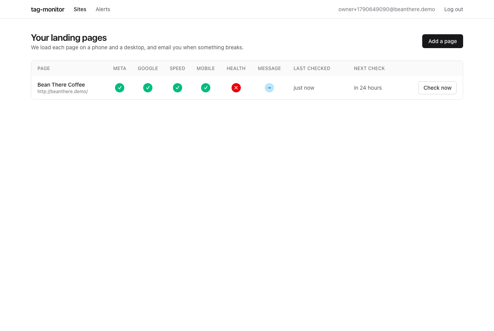
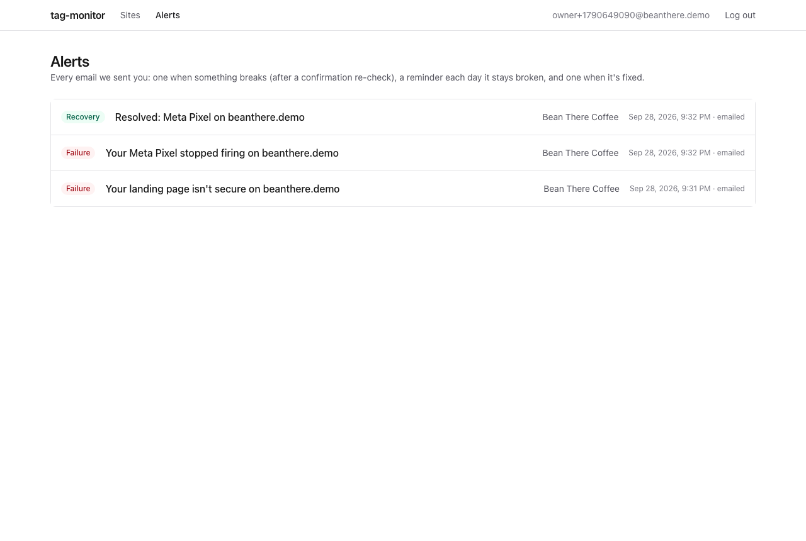
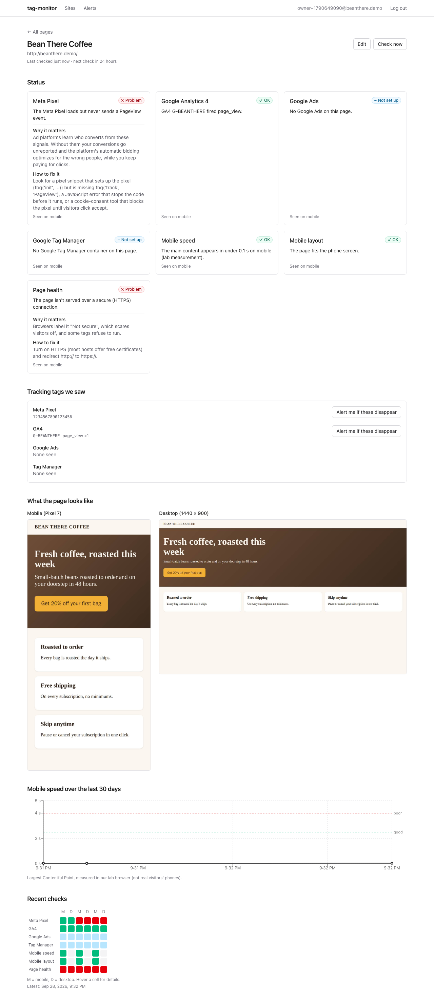
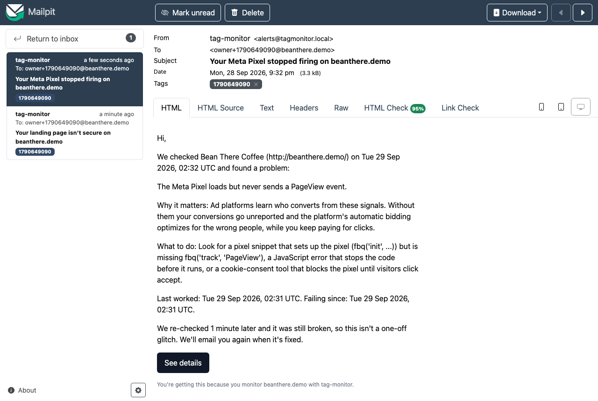

# Build log

tag-monitor was built in milestones M0 to M10 from [PRD.md](PRD.md). This log records what each one added, how it was verified, and what turned up along the way. The reasoning behind the design lives in [decisions.md](decisions.md). Every number here was produced by the command shown next to it; counts from a milestone describe the code as it was then.

## Status

| Area | State |
|---|---|
| Monitoring: capture, checks, queue, alerts, API, dashboard | Done. The full demo flow runs end to end in a real browser (below). |
| Tracking patterns | Verified against live sites on 2026-09-28 ([details](#verification-pass-2026-09-28)). |
| Queue benchmark | Tooling done. `make bench` writes [performance.md](performance.md). |
| Research scan | Tooling done and smoke-tested. The real run needs the hand-compiled `data/scan/targets.csv`. |
| Message match evals | Tooling done and tested. The results need human labels and an API key ([evals README](../evals/message_match/README.md)). |
| Deployment | Not hosted, by decision: it runs locally with `make dev` ([ADR-020](decisions.md#adr-020-run-locally-no-hosted-deployment-m10)). |

## Where the build departs from the PRD

The PRD was reviewed before any code was written. These are the places where following it literally would have produced a bug, and what was done instead.

| PRD says | Problem | Resolution |
|---|---|---|
| SSRF guard "via `context.route`" (§9) | Tested on Playwright 1.63: a route handler sees `GET /a` but not the redirect hops that follow, so a public URL redirecting to `127.0.0.1` gets through. | A per-capture egress proxy checks every connection the browser makes ([ADR-004](decisions.md#adr-004-enforce-the-ssrf-guard-in-a-per-capture-egress-proxy-not-only-in-contextroute-m2)). |
| Timeouts, DNS failures and 5xx are *transient job failures* (§12) and also make Page health *fail* (§10) | Retrying a down site until its job is dead saves no result, so a down site would never alert. | Website failures are data: the run completes and Page health fails. Retries are for our own failures ([ADR-006](decisions.md#adr-006-website-failures-are-data-only-our-own-failures-are-job-failures-m4)). |
| Every check fails when the page doesn't load | Five alerts for one outage. | Checks that need a loaded page return `error` ("not evaluated"), which never alerts. An outage sends one Page health email. |
| One `GoogleTagCheck` with three sub-results (§10) | Alert state is keyed by one check key, so "which tag broke?" is lost. | Three checks: `google_ga4`, `google_ads`, `google_gtm` ([ADR-009](decisions.md#adr-009-google-tags-are-three-checks-ga4-ads-gtm-not-one-check-with-sub-results-m3)). |
| Alert dedupe key `site:check:kind:state_entered_at` (§13) | Every reminder in one incident gets the same key, so only the first can be stored. | Reminders are keyed by the alert they follow. |
| Confirm job reuses the dedupe key `site:<id>` | The finishing job still holds that key, so the insert is silently skipped. | The job is marked succeeded, in the same transaction, before the confirm job is inserted. |
| `wrong_pixel` when *none* of the expected ids is seen | With two expected pixels and one removed, nothing alerts. | Fails when *any* expected id is missing. Identical for the usual single id. |
| Horizontal overflow: `scrollWidth > innerWidth` | Mobile Chrome widens `innerWidth` to fit wide content (1208 px on a 412 px phone), so the rule could never fire. | Compare with the device's viewport width. |
| The login rate limit | Storage for it isn't in §11. | A `login_attempts` table (migration 0003), so the limit survives restarts and works across API instances. |

## M0: Scaffold

**Built:** the repo layout, a uv project, the Next.js skeleton, Docker Compose (Postgres, MinIO, Mailpit, API, two workers, web), the Makefile, `.env.example` and CI. The API and the worker share one image ([ADR-002](decisions.md#adr-002-one-container-image-for-the-api-and-the-worker-m0)). The browser only talks to Next.js, which forwards `/api/*` to FastAPI ([ADR-003](decisions.md#adr-003-same-origin-proxy-for-the-api-m0)). The official MinIO image has left Docker Hub, so a maintained community build is used ([ADR-001](decisions.md#adr-001-run-minio-from-a-maintained-community-image-m0)).

**Verified:** `docker compose up -d --wait` brought every service up healthy, and `/api/health` answered both directly and through the web rewrite. The first CI run passed.

## M1: Database schema and migration runner

**Built:** [0001_init.sql](../db/migrations/0001_init.sql), with every table in PRD §11, the `site_latest_status` view, and each index commented with the query it serves. The migration runner applies each file in its own transaction, under an advisory lock, and refuses to run if an applied file has changed (checksums).

**Verified:** migrations apply to an empty database and a second run is a no-op. A deliberately broken migration leaves no trace, and two concurrent runners queue behind each other. 26 tests at the time.

**Departures:** `jobs.status` has no `failed` value, because §12 only ever produces `queued` (a retry) or `dead`. `sites.alert_email` is `NOT NULL`; the API fills in the account email.

## M2: Page capture, SSRF guard, fixture sites, tracking stubs

**Built:** `PageCapturer` (one Chromium per worker, a fresh context per capture), the SSRF rules and the egress proxy, fifteen fixture sites, and tracking stubs. The stubs answer Meta and Google tag requests locally with scripts that produce the same network traffic, so tests see real-shaped hits and nothing leaves the machine.

**Verified:** each fixture produces the expected `PageCapture` (23 tests). The SSRF suite (77 tests) covers schemes, credentials, ports, decimal, hex, octal and shorthand IPv4, IPv4 embedded in IPv6 (mapped, NAT64, 6to4), every blocked range, and a real browser following a public URL that redirects to `127.0.0.1`: the request is blocked, and the fixture server confirms the internal URL was never requested.

**Found along the way:** "network quiet" originally meant "no new request for 2 s". A 5-second image that started at 0 s ended the wait as soon as it arrived, before Chrome reported its paint, so LCP was read too early and one test failed depending on order. Counting finished requests as activity fixed it: the slow-LCP fixture read 5.03 to 5.04 s across 8 back-to-back captures.

## M3: Checks

**Built:** Meta Pixel, GA4, Google Ads, Tag Manager, mobile speed, mobile layout and page health, each a pure function of a capture ([ADR-005](decisions.md#adr-005-capture-once-analyze-many-m2), [ADR-008](decisions.md#adr-008-detect-tags-by-observing-network-requests-not-by-searching-the-html-m3)). All three tag checks walk the same ordered questions (`checks/tag_verdict.py`), so a status means the same thing for every tag. Each outcome has a machine-readable code and a plain-English explanation, from which [check-explanations.md](check-explanations.md) is generated; a test fails if the two drift.

**Verified:** every fixture, captured in real Chromium, yields the expected status *and* code for all 7 checks (`tests/fixture_expectations.py` is the whole table on one screen). The same table passes against 15 saved captures with no browser. The CLI `python -m tagmonitor.check <url>` prints a Rich report.

## M4: Job queue, scheduler, workers, storage

**Built:** a Postgres queue with a single-statement `FOR UPDATE SKIP LOCKED` claim ([ADR-010](decisions.md#adr-010-the-job-queue-lives-in-postgres-m4)). Leases are fenced by `(id, locked_by, attempts)`, so a worker that stalled while the reaper handed its job to someone else can't complete it twice. Also: heartbeats, a reaper, exponential backoff with jitter, a scheduler and per-domain politeness under advisory locks ([ADR-011](decisions.md#adr-011-advisory-locks-for-the-scheduler-the-reaper-and-per-domain-politeness-m4)), graceful shutdown, and MinIO storage for captures and screenshots.

**Verified:** 20 concurrent claimers drained 400 jobs, and every job was claimed exactly once. On the live stack, the two worker containers split 8 due sites 5 and 3. Also tested: backoff bounds, the reaper (including a poison-pill job going dead), fencing, the domain lock refunding the attempt, and an interrupted job going back to the queue on shutdown.

## M5: Alerts

**Built:** the per-(site, check) state machine: healthy, then suspect plus a confirmation re-check, then alerting ([ADR-012](decisions.md#adr-012-confirm-a-failure-with-a-re-check-before-alerting-m5)). A transactional outbox writes alert rows and their send jobs in the transaction that saves the results ([ADR-013](decisions.md#adr-013-transactional-outbox-for-alerts-m5)). Plus console, SMTP and Resend senders, and plain-English emails.

**Verified:** a 15-row transition table. Scenarios against Postgres: a flake (fail, then pass) sends 0 emails; 5 failures over 2 days send 1 failure alert and 1 reminder; recovery sends 1. An end-to-end test drives a real browser and worker into Mailpit.

## M6: API and auth

**Built:** signup, login and logout with argon2id and server-side sessions; CSRF defense (`SameSite=Lax` plus a required `X-Requested-With` header); a login rate limit in Postgres; site CRUD with the SSRF check; "Check now" (which promotes an already-queued job instead of adding one); keyset-paginated run history; presigned screenshot links; trends; alerts; and an admin-only ops endpoint ([ADR-014](decisions.md#adr-014-server-side-sessions-in-postgres-cookie--header-csrf-defense-m6)).

**Verified:** auth, IDOR (a second user gets 404 on every one of the first user's endpoints), rate limit and endpoint tests.

**Found along the way:** trusting `X-Forwarded-For` behind the Next.js proxy looked right but wasn't. A live check showed the API still saw the web container's IP, and the Next.js 16.3 source confirmed that external rewrites don't add the header while a client-supplied one passes straight through. Trusting it would have let an attacker send a fresh fake IP with every login attempt. The safe default stays, with a regression test.

## M7: Web dashboard

**Built:** the landing page, auth pages, dashboard, add and edit forms, and the site page. The site page has status cards with how-to-fix text, the tags and events seen (plus "Alert me if these disappear", which turns detected ids into expected ones), screenshots, the LCP trend, a run-history grid and live job polling. Plus the alerts page and a local demo page, "Bean There Coffee", whose tags are answered by stubs ([ADR-015](decisions.md#adr-015-a-local-demo-harness-that-cant-weaken-production-m7)).

**Verified:** all eight PRD acceptance steps (sign up, add a page, first check, break the pixel, confirmation re-check, alert email, fix, recovery email) run in a real browser against the live stack, driven by [scripts/demo_walkthrough.py](../scripts/demo_walkthrough.py).

**Found along the way:** the dashboard's single Google dot said "not set up" while GA4 was firing, because the worst-of rule let an uninstalled Ads tag win. Combining *different* tags now ranks a working tag above a missing one. And "Check now" was disabled while a confirmation re-check sat queued, so clicks waited up to 10 minutes; the API now pulls the queued job forward.

| | |
|---|---|
|  |  |
|  |  |

## M8: Research scan

**Built:** target vetting (one page per registrable domain; rows that aren't a domain are skipped), robots.txt checks through the same SSRF proxy, `scan_url` jobs at the lowest priority, and `scan analyze`. The analysis reports the §16 metrics with 95% Wilson intervals, an LCP histogram, a breakdown by category, and a methodology and limitations section. It publishes aggregates only ([ADR-016](decisions.md#adr-016-the-research-scan-reuses-the-monitoring-pipeline-and-publishes-aggregates-only-m8)).

**Verified:** tests cover robots.txt outcomes, a full scan run by a real worker against the fixture server, the Wilson intervals, and an assertion that the report contains no URLs or hostnames. A smoke run found that typos and private IPs were being counted as "attempted but unreachable", which would have deflated the reachability rate with data-entry mistakes; they're now skipped at vetting.

## M9: Message match and evals

**Built:** the model call happens outside the check, which stays a pure mapping from a verdict to a status ([ADR-017](decisions.md#adr-017-the-model-call-happens-outside-the-check-the-check-maps-a-verdict-to-a-status-m9)). The call forces a tool call validated with Pydantic, retries once and feeds back the validation error, caches on model, prompt and text, and keeps a race-free daily budget. Also: a versioned prompt, and eval CLIs for collecting, labeling, splitting, running and reporting.

**Verified:** quadratic-weighted kappa matches scikit-learn to 1e-12 on 25 random datasets. The daily limit holds with 10 concurrent callers against a limit of 3 (exactly 3 calls go through). The real SDK is exercised against a mock HTTP server. Without an API key, the check reports that it's turned off.

## M10: Benchmark, ops, retention, and the verification pass

**Built:** the queue throughput benchmark (`make bench`), the ops page, and the retention job ([ADR-018](decisions.md#adr-018-retention-keeps-each-sites-latest-state-and-deletes-rows-before-objects-m10)).

### Verification pass, 2026-09-28

The earlier milestones were built in an environment without general internet access. This pass ran on a laptop with internet access (macOS, Docker Desktop), starting from a fresh clone.

- **Tests and lint.** `make test`: 544 passed before this pass's fixes and 563 after them (the difference is the new regression tests). `make lint` (ruff, ruff format, strict mypy, eslint, tsc) was clean both times.
- **Quickstart.** `make dev` from the fresh clone brought every service up healthy. The demo walkthrough then ran all eight acceptance steps in 94 s.
- **Tracking patterns on live sites.** `python -m tagmonitor.verify_patterns` and `make check` on four large US online retailers' home pages (mobile). Meta Pixel (script, per-pixel config and `PageView`), GA4 and Google Ads traffic all matched, and the full report gave the expected verdicts. The run also turned up two endpoints the patterns didn't know: `googletagmanager.com/gtag/destination?id=…`, which on one site was the *only* way its Google Ads tag loaded, and `googleadservices.com/ccm/conversion/<id>/`. Both were added with tests; before the fix, a GTM-managed tag that loaded but never sent a hit would have been reported as "not installed" instead of "installed but not firing".
- **SSRF with real DNS.** Adding `localhost`, `169.254.169.254`, `2130706433`, `localtest.me`, `127.0.0.1.nip.io`, `[::ffff:10.0.0.1]`, the Docker service names and non-standard ports through the running API: all refused.
- **Bugs fixed, each with a regression test:**
  - The dashboard kept showing results from checks that no longer run, such as a message match verdict after the ad copy was deleted (migration 0005, [ADR-019](decisions.md#adr-019-the-dashboard-shows-the-latest-check-a-new-page-or-a-new-ad-starts-its-alert-history-over-m10)).
  - Changing a site's URL kept the old page's alert states and didn't check the new page until the next scheduled run.
  - The egress proxy only tried the first address DNS returned, so one unreachable address made a working site look down.
  - The dashboard showed "not checked yet" forever for message match on sites without ad copy.
  - Two buttons on the site and edit pages left the UI stuck when their request failed.
  - The run-history grid left out message match.

## Regenerating the screenshots and demo GIF

With `make dev` running:

```bash
cd server && uv sync && uv run playwright install chromium   # once
uv run python ../scripts/demo_walkthrough.py --video /tmp/demo-video
ffmpeg -i /tmp/demo-video/<the larger .webm> -vf "setpts=PTS/4,fps=8,scale=880:-1:flags=lanczos,split[a][b];[a]palettegen=max_colors=96[p];[b][p]paletteuse=dither=bayer:bayer_scale=5" ../docs/img/demo.gif
```

The script writes the screenshots to `docs/img/`. Clear Mailpit first (`curl -X DELETE localhost:8025/api/v1/messages`) so the email screenshot doesn't show emails from the test suite.
