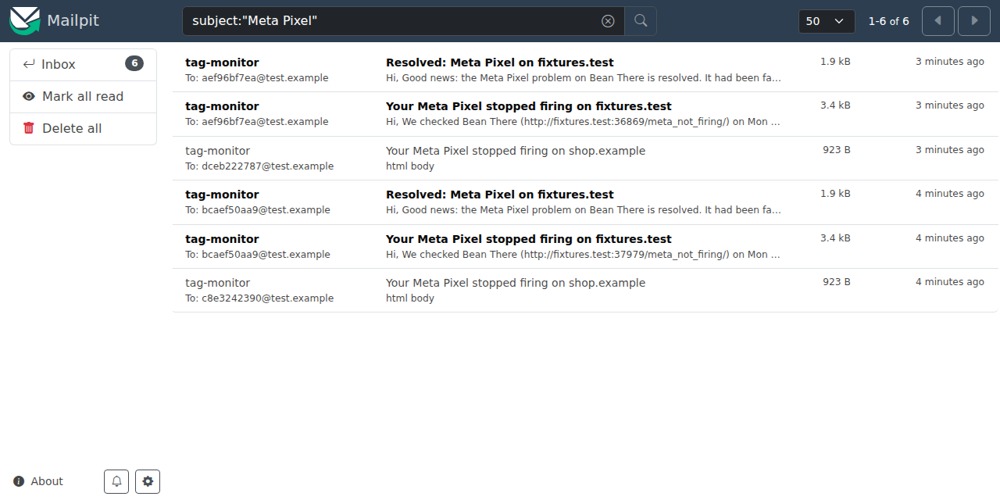
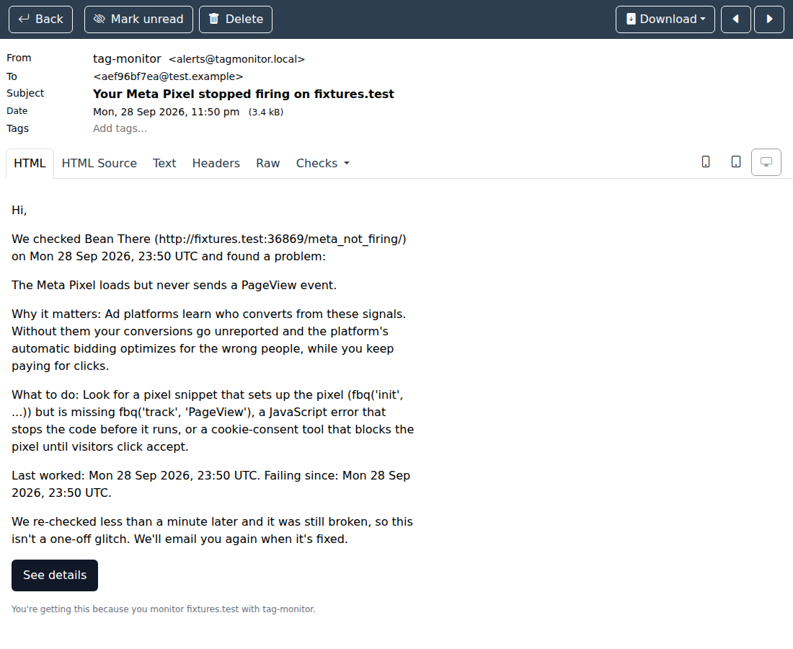

# M5: Alerts

## Acceptance criteria

| Criterion | Evidence |
|---|---|
| All transition tests pass | `tests/test_state_machine.py`: 15-row table covering every transition (healthy, suspect and alerting × pass, warn, info and fail, including the reminder edges at 23.9 h and 24 h), plus "error changes nothing" in every state, counters and timestamps, and the reminder clock resetting. |
| All scenario tests pass | `tests/test_alert_outbox.py` against Postgres: **flaky** (fail then pass) → 0 alerts; **persistent** (5 failures over 2 days) → 1 failure + 1 reminder; **recovery** → 1 recovery. Also: one confirmation job however many checks fail at once, a page outage alerts once (Page health only), broken on mobile only still counts, email history lines, the window-function history query, and dedupe keys. |
| Emails are visible in Mailpit | `tests/test_alert_e2e.py`: real browser, real worker, SMTP into Mailpit. The pixel works → it breaks → the first failure makes it suspect → the confirmation re-check → "Your Meta Pixel stopped firing on fixtures.test" arrives → the pixel is fixed → "Resolved: Meta Pixel on fixtures.test" arrives. Exactly those two Meta emails. Screenshots below. |
| Tests, lint, types | **325 passed** (`docker compose run --rm tests`, 150 s). ruff, ruff format, mypy --strict: clean. |





(The "less than a minute later" line is because the test sets the confirmation delay to 0; the default is 10 minutes.)

## Try it yourself

```bash
make test                                   # includes the end-to-end email test
open http://localhost:8025                  # Mailpit: the emails the tests sent
cat docs/check-explanations.md              # the "why it matters / what to do" copy used in emails
```

## Design decisions to be ready to explain

1. **Confirm before alerting (ADR-012).** First failure → "suspect" and a re-check 10 minutes later. Only a second failure emails. It trades 10 minutes of latency for no false alarms, and the flaky-scenario test proves it.
2. **Transactional outbox (ADR-013).** Results, state changes, the alert row and its send job commit together, so an alert can't be lost or sent for data that rolled back. Delivery is at-least-once, with an idempotency key so the provider drops duplicates.
3. **The state machine is pure** (no DB, no clock: `now` is a parameter). That's why a 15-row table test can cover every transition in milliseconds, and why the 2-day scenario runs instantly.
4. **"Couldn't evaluate" isn't evidence.** `error` results never move a state machine: a page outage alerts once (Page health), not once per tag, and it doesn't end or restart a tag's failing streak.
5. **Emails for non-technical owners.** A subject that says what broke ("Your Meta Pixel stopped firing on …"), then what we saw, why it matters, what to do, when it last worked, and a link. Recovery says "Resolved", not "working again", because a pixel that was deliberately removed also "resolves".

## Deviations from the PRD (please read)

- **Reminder dedupe keys.** The PRD's `site:check_key:kind:state_entered_at` would give every reminder in one incident the same key, so only the first reminder could ever be stored. Reminders are keyed by the alert they follow; failure and recovery keys are as specified.
- **What counts as "passing" for alerting:** pass, warn and info (anything but fail); `error` is ignored. The PRD only says warnings don't alert. I made the rest explicit.
- **`sites.alert_email`** receives the emails (the account email is the default in M6).

## Decisions recorded

ADR-012 (confirm re-check), ADR-013 (transactional outbox).

## Worth reading carefully

- `server/src/tagmonitor/alerts/state_machine.py`: the whole policy in about 70 lines.
- `server/src/tagmonitor/alerts/outbox.py`: the transaction boundary and the window-function query.
- `server/src/tagmonitor/alerts/content.py`: the email copy. It's yours to tune.

## Unsure about

- The fixture sites are `http://`, so in the demo (M7) Page health also emails "Your landing page isn't secure". That's correct behavior, but noisy for a demo GIF; M7 deals with it.
