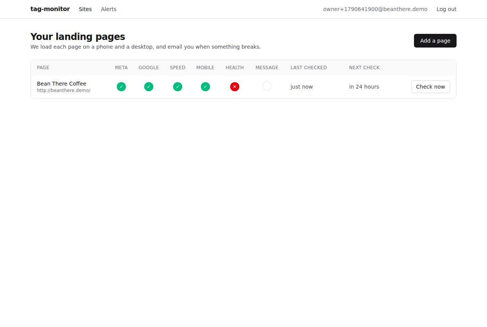
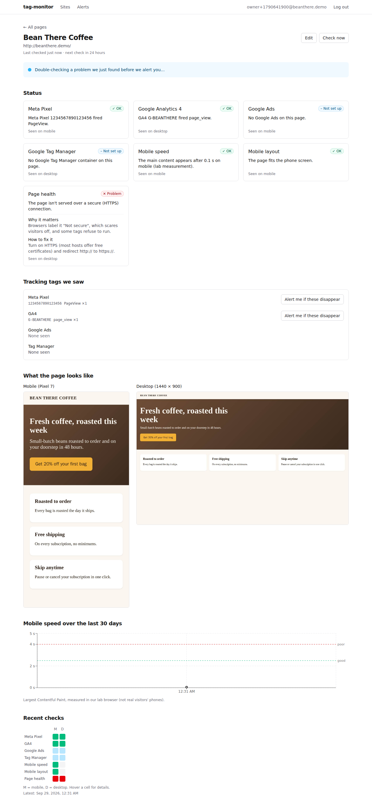
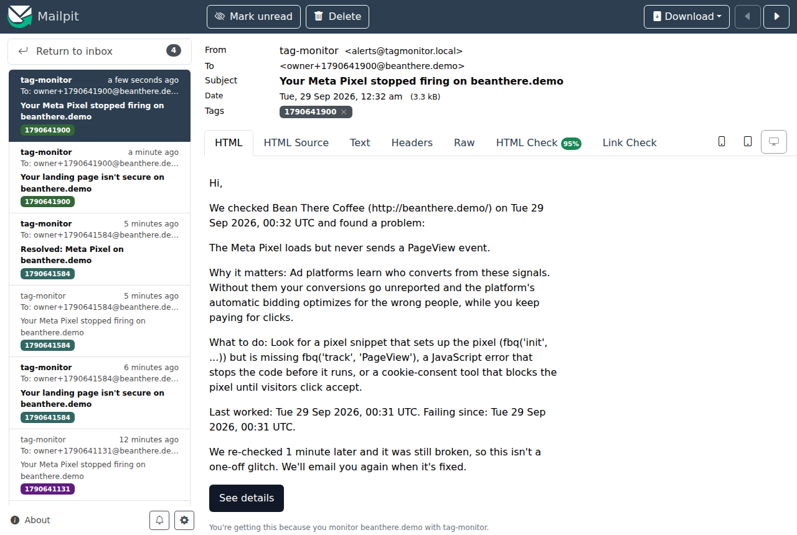
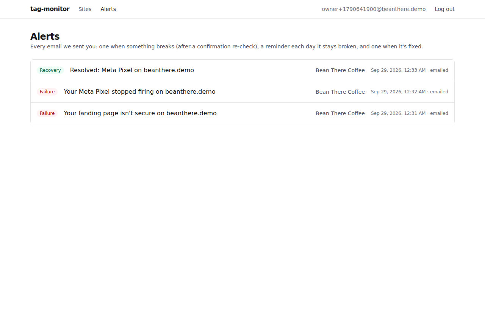

# M7: Web dashboard

## Acceptance criteria: the full flow in the UI

All eight steps ran in a real browser against the live `docker compose` stack, driven by `scripts/demo_walkthrough.py` (95 s end to end; with the dev settings the confirmation re-check runs 60 s after a first failure). The screenshots below are from that run.

| Step | What happened |
|---|---|
| 1. Sign up | `/signup` → account created → redirected to the dashboard. |
| 2. Add a site | "Add a page" → `http://beanthere.demo/` ("Bean There Coffee") → the site page opens and its first check is queued. |
| 3. The first check completes | Meta Pixel `1234567890123456 fired PageView`, GA4 `G-BEANTHERE fired page_view`, speed and layout OK, screenshots for mobile and desktop. (Page health honestly flags plain HTTP.) |
| 4. Break a fixture's pixel | `make demo-break-pixel` (the script touches the same flag file), then "Check now". |
| 5. The confirm check runs | The first failure makes Meta "suspect"; the page shows "Double-checking a problem we just found before we alert you…" while the confirmation re-check is queued, then runs it. |
| 6. An alert arrives in Mailpit | "Your Meta Pixel stopped firing on beanthere.demo". |
| 7. Fix the pixel | `make demo-fix-pixel`, then "Check now". |
| 8. A recovery email arrives | "Resolved: Meta Pixel on beanthere.demo", also listed on the Alerts page. |

Tests, lint, types: web `npm run lint`, `npm run typecheck` and `npm run build`: clean. Server: **371 passed** (`docker compose run --rm tests`), ruff and mypy clean.










## Try it yourself

```bash
make dev                       # then open http://localhost:3001 and sign up
# add http://beanthere.demo/ as a page (it's the demo landing page, also at http://localhost:8088)
make demo-break-pixel          # then click "Check now" on the site page
open http://localhost:8025     # Mailpit: the alert arrives after the confirmation re-check (60 s in dev)
make demo-fix-pixel            # "Check now" again -> recovery email
```

Or let the script do it (and record a video for the README GIF):

```bash
cd server && uv run playwright install chromium    # once
uv run python ../scripts/demo_walkthrough.py --video ../demo-video
```

## What's on each page

- **Landing (`/`)**: what it checks, why it matters, "one clear alert, not fifty", and a placeholder for the research findings (M8).
- **Dashboard**: status dots for Meta, Google (GA4 + Ads + GTM), Speed, Mobile, Health and Message match (M9); last and next check as relative times; Check now. It refreshes every 5 s.
- **Add / edit a page**: URL, name, interval, alert email, expected IDs with where-to-find-them help, and optional ad copy; pause and delete.
- **Site page**: status cards with "why it matters / how to fix it", the tags and events actually seen (with **"Alert me if these disappear"**, which turns detected IDs into expected IDs in one click; see the kickoff open question 1), mobile and desktop screenshots via 10-minute presigned links, the LCP trend with the 2.5 s and 4 s thresholds, a run-history grid, and job polling every 3 s while a check runs.
- **Alerts**: every email sent (failure, reminder, recovery).

The ops page is part of M10.

## Design decisions to be ready to explain

1. **Client-side data fetching through the same-origin proxy.** Every page is a client component calling `/api/*` on its own origin, so the httpOnly session cookie just works (ADR-003) and there's no server-side cookie forwarding to get wrong.
2. **Status is never color only.** Each status has a symbol (✓ ! ✕ – ?) and a text label (for screen readers and on hover); the history grid has per-cell descriptions; forms use real `<label>`s.
3. **Combining statuses depends on what you combine.** One check across two devices: the worst result wins (fail > warn > info > pass). Different tags in one column (Google = GA4 + Ads + GTM): a tag that isn't installed mustn't hide one that works, so "pass" outranks "not installed". I found this from the screenshot review: the Google dot said "not set up" while GA4 was firing.
4. **"Check now" pulls a queued check forward.** Found in the first walkthrough: the button was disabled while a confirmation re-check was queued, so clicks waited up to 10 minutes. Now it's only disabled while a check is actually running; the API promotes a queued job.
5. **Demo harness isolated from production (ADR-015).** The allowlist and stubs are set only in the dev compose file, and stubs apply only to allowlisted hosts.

## Changes made along the way

- The Meta stub now fetches `/signals/config/<pixel id>` like the real `fbevents.js`, so a pixel that's installed but silent still shows its ID in "Tracking tags we saw". Saved fixture captures were regenerated.
- Speed summaries say "in under 0.1 s" instead of rounding a 30 ms paint to "0.0 s".
- Dev-only `.env` values: confirmation delay 60 s and check-now cooldown 20 s (the code defaults stay 600 s and 300 s).

## Decisions recorded

ADR-015 (the demo harness).

## Worth reading carefully

- `web/app/(app)/sites/[id]/page.tsx` and `web/components/`: the site page is the core of the product.
- `web/lib/api.ts`: one fetch wrapper (CSRF header, error messages from FastAPI).
- `scripts/demo_walkthrough.py`: the acceptance flow as code.

## Unsure about

- Mobile layout below 400 px has only been eyeballed in the Pixel 7 screenshot; the dashboard table scrolls horizontally on phones by design.
