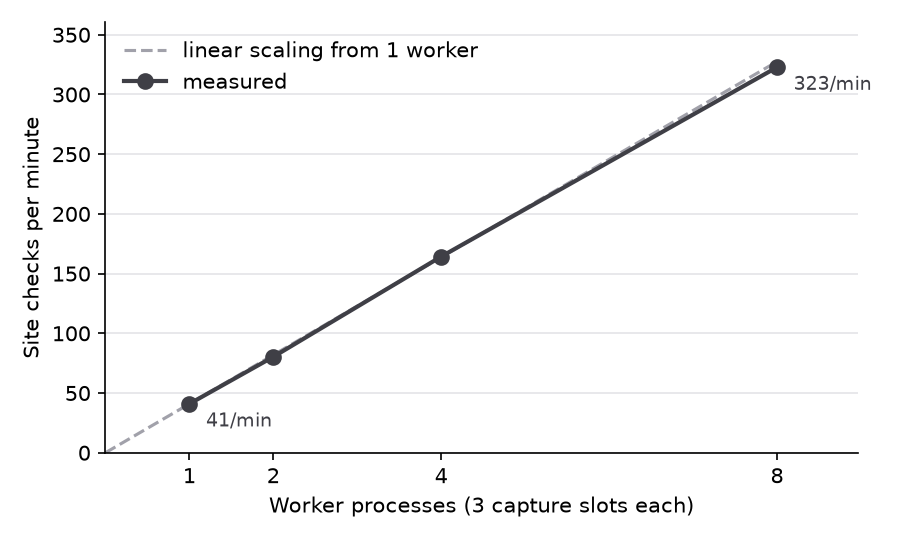

# Performance: queue throughput

> Generated by `make bench` (`server/benchmarks/queue_throughput.py`). Every number below comes from that run; re-run it to reproduce on your machine.

- Run: 2026-09-29 05:05 UTC, commit `069502f`
- Machine: 4 CPUs (aarch64), 7.7 GB RAM, inside the docker compose `tests` container, with Postgres and MinIO in their own containers on the same host.
- Workload: 500 site checks per configuration. Each is a real `capture_and_check` job: headless Chromium loads a local fixture page on mobile and desktop (so 2 page loads, each waiting for 2 s of network quiet), the captures and screenshots go to MinIO, the checks run, and results and alert states are saved in one transaction. Each site has its own hostname, so the per-domain lock never makes a worker wait.

| Worker processes | Capture slots | Jobs | Wall time | Site checks / min | Speed-up | Job time p50 / p95 | CPU busy | Retried / duplicate runs / missing runs |
|---|---|---|---|---|---|---|---|---|
| 1 | 3 | 500 | 733 s | **40.9** | 1.00x | 4.4 s / 4.5 s | 6% | 0 / 0 / 0 |
| 2 | 6 | 500 | 373 s | **80.3** | 1.96x | 4.4 s / 4.6 s | 10% | 0 / 0 / 0 |
| 4 | 12 | 500 | 183 s | **164.3** | 4.01x | 4.3 s / 4.6 s | 18% | 0 / 0 / 0 |
| 8 | 24 | 500 | 93 s | **322.8** | 7.88x | 4.3 s / 4.9 s | 35% | 0 / 0 / 0 |

Wall time runs from the commit that enqueued the jobs to the last job's finish (database timestamps). Zero duplicates is checked, not assumed: every job must have exactly one attempt and exactly one mobile and one desktop run.

Jobs per worker process: 1 worker(s): 500; 2 worker(s): 249, 251; 4 worker(s): 125, 124, 126, 125; 8 worker(s): 61, 63, 63, 63, 63, 61, 63, 63.

## Reading it

- From 1 to 8 worker processes, throughput went from 40.9 to 322.8 site checks per minute (7.88x for 8x the workers), and the CPUs went from 6% to 35% busy.
- The CPUs weren't saturated even at 8 workers (35% busy), so the jobs' own waiting (2 s of network quiet per page load) dominates, and more capture slots per worker should add throughput.
- A job took about as long with 8 workers as with 1 (4.3 s vs 4.4 s median), so the extra workers didn't slow each other down.
- Measured throughput was 96% to 99% of the ceiling of capture slots x 60 / median job time, so claiming jobs, heartbeats and saving results add little on top of the page loads. Part of the gap is the end of each run, when slots sit idle while the last jobs finish: with 8 workers, one job's time is 5% of the 93 s run.
- Real sites add network latency per page: jobs take longer but use little extra CPU, so on real traffic each worker's slots are busier waiting than computing.
